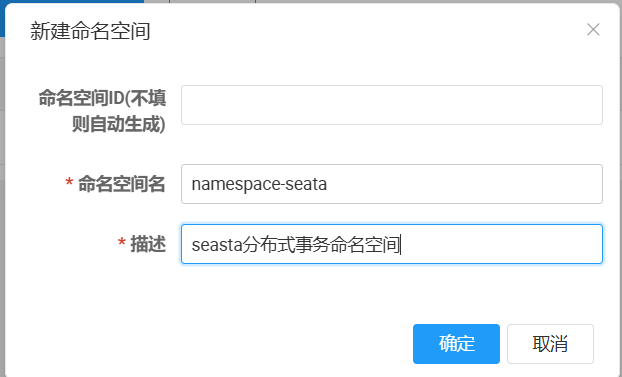
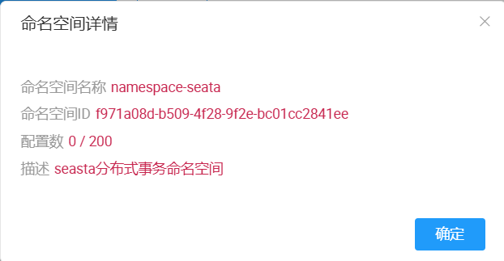

# 环境准备

## JDK
```shell
tar -zxvf jdk-8u202-linux-x64.tar.gz
mv jdk1.8.0_202 /usr/local/java

cat >> /etc/profile << ROF
JAVA_HOME=/usr/local/java/
JRE_HOME=/usr/local/java/jre/
CLASSPATH=.:$JAVA_HOME/lib/dt.jar:$JAVA_HOME/lib/tools.jar/:$JRE_HOME/lib/rt.jar

PATH=$PATH:$JAVA_HOME/bin/

export PATH CLASSPATH JAVA_HOME JRE_HOME
EOF
source /etc/profile
```

## MySQL 8

1. 新建数据库nacos
2. 运行`nacos/conf/mysql-schema.sql`
3. 放开注释，并修改成自己的配置
```properties
spring.datasource.platform=mysql
db.num=1
db.url.0=jdbc:mysql://10.10.10.100:3306/nacos?characterEncoding=utf8&connectTimeout=1000&socketTimeout=3000&autoReconnect=true&useUnicode=true&useSSL=false&serverTimezone=UTC
db.user.0=root
db.password.0=MySQL123!
```

## Nacos

```shell
# 上传nacos-server软件包

# 解压缩
unzip nacos-server-2.4.3.zip
mv nacos /usr/local/nacos
# 启动nacos
./bin/startup.sh  -m standalone
```

创建命名空间，记住id




# Seata
